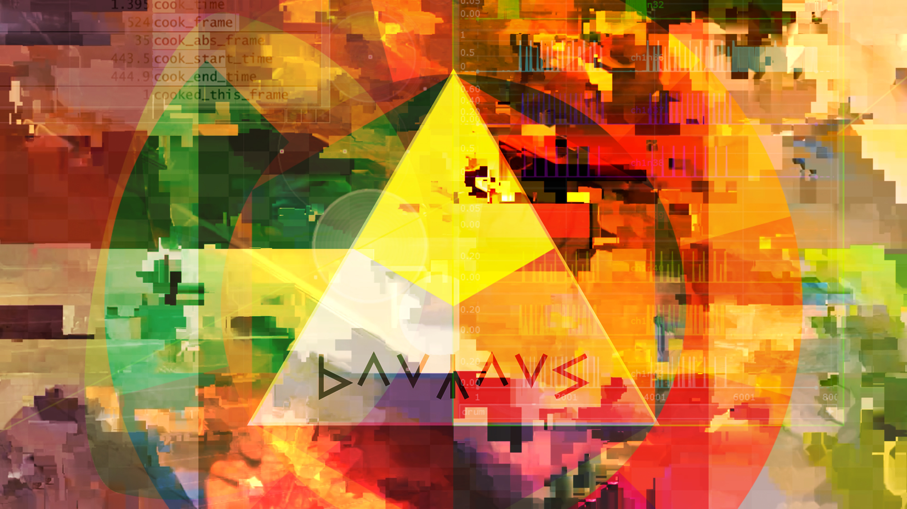

# TD_WRSHP_BHS_Montral_8-19
 

Why the Bauhaus would have loved TouchDesigner

When Walter Gropius founded the legendary design school Bauhaus one hundred years ago in the German town of Weimar, the world had been turned upside down. Industrialization had severely changed people's everyday lives and WWI had shown the brutal potential of these new technologies. At this time, design and architecture had been struggling to find a new language that was appropriate for these radically changing means of production. In this fragile situation the architect Walter Gropius managed to gather some of the finest artists and designers of his era and founded a new school where art and design were taught in a completely new way.

How could the Bauhaus achieve this? With the Bauhaus Manifesto, Gropius took inspiration from the idea of the Bauhütte, the mystical design studio of the ancient cathedrals, where all crafts were united to make one holistic vision come to life. At the same time, students of the Bauhaus were encouraged to take matters into their own hands. In different workshops they were free to experiment with craft techniques and as a result produced a range of experimental works. This approach allowed students and masters to quickly overcome traditional thinking about form, color, and space and extract from this creative exploration what would come to be known as the International Style, the first global design language that continues to shape our reality today.

One hundred years later, we find ourselves in a similar situation. New technologies demand new design solutions yet specialization will not necessarily lead us down the right path. Much like the Bauhaus dreamed of art, life, and craft as a holistic gesamtkunstwerk (total work of art), working with TouchDesigner allows us to integrate all art displicines into one experience that permeates both the real and the virtual.

In this workshop participants will learn to make first steps in TouchDesigner and at the same time get to know some of the iconic works of the Bauhaus. These will be used as inspiration for practical exercises in the program.